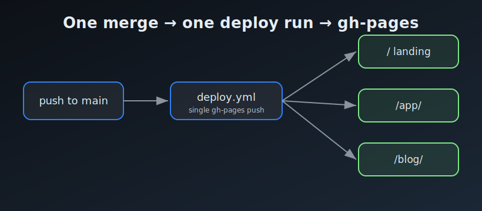

> **At a glance —** a single `deploy.yml` run publishes the landing page, the app, and
> this very blog post to `gh-pages` in one push — no second workflow to race or cancel it.

## The problem

The template needs a browsable site — a landing page, the built app, and a blog —
served from the `gh-pages` branch and refreshed automatically on every merge to
`main`, without separate workflows racing or cancelling one another on the shared
branch.

## Options

- **Separate workflows** for the site and the blog, each pushing to `gh-pages`:
  easy to read, but they collide on the shared concurrency group when a merge
  triggers them at the same instant — one gets cancelled.
- **One workflow run** that assembles everything and pushes once: marginally less
  modular, but there is nothing to race or cancel.

## The strategy

`deploy.yml` runs on each push to `main`. It assembles the static scaffolding, the
app (located via `pages.config.yml`), and any blog posts the push introduced into a
single directory, then publishes to `gh-pages` in one step — `keep_files: true`
preserves everything already there.

## The results

This post is the proof: it shipped through that pipeline. The demo app is live at
`/app/`, the blog at `/blog/`, and the landing page ties them together — all from a
single deploy run.

## Screenshots

